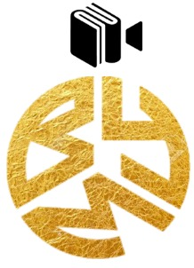

  

  <h3 align="center">byMood</h3>

-green)

  

    byMood predicts and categorizes your mood, which you type as a prompt, with sentiment analysis. In this way, it recommends you the best movies, books, and music.
     
    
  

## Table of contents

- [Table of contents](#table-of-contents)
- [Quick start](#quick-start)
- [Features](#features)
- [How works](#how-works)
- [Tech](#tech)
- [What we have in mind](#what-we-have-in-mind)
- [Bugs, feature and contribution requests](#bugs-feature-and-contribution-requests)
- [Creators](#creators)
- [Changelog](#changelog)

## Quick start

You can reach byMood by <a href="http://bymood.me/"> clicking here </a>

- Get book, movie and music recommendations by entering your mood as prompt
  

## Features

* Book Recommendation
* Movie Recommendation
* Music Recommendation

## How works

byMood uses many different machine learning models and supporting algorithms. Basic working principle; It categorizes the prompt with the NLP method and transfers it to the recommendation system algorithms and machine learning models.

## Tech

## What we have in mind

* byMood does not collect any data in v0.2 (beta). We want to improve the model and system by collecting only prompts in new versions.
* We don't want to settle for book, movie and music recommendations. We want to create a wider range of recommendation systems. We are working on it.
* We want to get out of Streamlit's playground and create our own free garden. In this way, we aim to act more freely, increase our innovation and sustainability, and solve platform problems that may arise.

## Bugs, feature and contribution requests

We can create a more useful and bug-free platform by notifying us of the features you see as bugs or missing and want to be added. Also, don't forget to contact us if you want to contribute to byMood. :metal: 

## Creators

**Samet Arda Erdogan** : <https://www.linkedin.com/in/ardasamet/>

**Umit Can Inozu** : <https://www.linkedin.com/in/ümit-can-inözü/>

## FAQ

**Q1: What technologies does byMood use?** 

* Mostly; Python, SQL, Pandas, Numpy, Scikit-learn, Tensorflow, Streamlit

**Q2: What is the dataset source? Is the data up to date?** 

* Datasets are updated weekly with a running API script.

**Q3: Do machine learning models use feedback loops?** 

* Currently, no data is collected in the current version(``v0.2``). So a feedback system is not integrated

## Changelog

> 31/03/2023 |  Music recommendation added. Bug fixes. Version changed, version ``v0.2`` is available.

> 27/03/2023 |  byMood released. Beta version ``v0.1`` is available.
